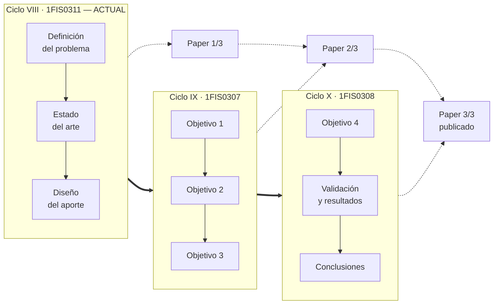
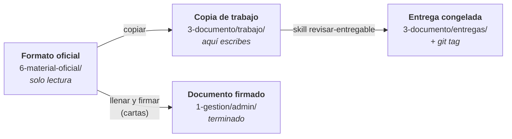

# Proyecto de Tesis — Ingeniería de Sistemas UPC

**Un solo proyecto continuo repartido en tres ciclos**, no tres trabajos distintos.
Cada curso continúa donde terminó el anterior, sobre el mismo documento y el mismo paper.



| Ciclo | Curso | Produce |
|---|---|---|
| VIII | **1FIS0311 Seminario de Investigación Aplicada** ← actual (2026-25) | Problema · Estado del arte · Diseño del aporte · Plan · Paper 1/3 |
| IX | 1FIS0307 Proyecto de Investigación 1 | Objetivos 1-3 de la solución · Paper 2/3 |
| X | 1FIS0308 Proyecto de Investigación 2 | Objetivo 4 · Validación · Resultados · Conclusiones · Paper 3/3 |

**Empieza por [`1-gestion/CONTEXTO.md`](1-gestion/CONTEXTO.md)** — hechos del curso, fechas, pesos,
criterios de fuentes y estado actual. Las reglas de trabajo están en [`CLAUDE.md`](CLAUDE.md).

---

## Estructura

```
tesis/
├── CLAUDE.md              Reglas de trabajo (marcadas por origen)
├── gh-tesis               Envoltorio de gh aislado del entorno de trabajo
├── 1-gestion/
│   ├── CONTEXTO.md        ← FUENTE DE VERDAD del curso
│   ├── cronograma.md      15 semanas + hitos de evaluación
│   ├── preguntas-abiertas.md   Dudas para el profesor / asesor / coordinación
│   ├── bitacora/          Una entrada por sesión de trabajo
│   ├── asesorias/         Actas de reunión (artefacto de gestión evaluado)
│   ├── plan-proyecto/     Alcance, cronograma, calidad, riesgos
│   └── admin/             Documentos administrativos ya firmados
├── 2-fuentes/             El activo que más valor acumula en 3 ciclos
│   ├── guia-zotero.md
│   ├── biblioteca.bib     Referencias (export de Zotero)
│   ├── matriz-estado-arte.csv   → se convierte en la tabla del cap. 2.3
│   ├── pdfs/              PDFs originales — solo renombrar, nunca editar
│   ├── fichas/            Nota interna de lectura, una por artículo
│   └── busquedas/         Registro de cada búsqueda, con fecha y cribado
├── 3-documento/           Solo lo que TÚ escribes
│   ├── trabajo/           Donde se escribe (Word)
│   └── entregas/          Congeladas al entregar
├── 4-paper/               El artículo científico (IEEE)
├── 5-solucion/            Código y artefactos del aporte (ciclos IX-X)
│   ├── data/raw/          Datos originales — inmutable
│   ├── data/processed/    Datos derivados
│   ├── src/               Código
│   └── results/           Figuras, tablas, resultados
├── 6-material-oficial/    TODO lo que da la universidad — SOLO LECTURA
│   ├── general/           Transversal a los 3 ciclos (las 2 cartas a firmar)
│   ├── 2026-25-seminario-investigacion/
│   │   ├── clase-01/      Láminas y lecturas de clase
│   │   ├── formatos/      Formularios a llenar (Plan de Trabajo, sem. 2)
│   │   └── Línea de tiempo-202625.pdf
│   ├── proyecto-investigacion-1/    (ciclo IX, vacío por ahora)
│   └── proyecto-investigacion-2/    (ciclo X, vacío por ahora)
└── 7-archivo/             Descartes y versiones muertas (no se borra)
```

### La regla que ordena todo

**Si lo dio la universidad, está en `6-material-oficial/` y no se toca.
Todo lo demás lo produces tú.**

De ahí se derivan las otras dos: los formatos de entregable los da el profesor semana a semana
(si falta uno, se pide — no se inventa), y para trabajar **se copia** el original,
nunca se edita en su sitio.



La ubicación de un archivo dice **quién es su dueño y en qué estado está**.
La numeración `1-` a `7-` dice **cuándo lo trabajas**.

---

## Flujo semanal

1. Abrir `1-gestion/CONTEXTO.md` §11 y `cronograma.md` → qué semana es y qué toca
2. Buscar fuentes con la skill `buscar-fuentes` → registro en `2-fuentes/busquedas/`
3. Fichar cada artículo aceptado (`fichar-articulo`) → ficha + BibTeX + fila de matriz
4. **Copiar** el formato de `6-material-oficial/<ciclo>/formatos/` a `3-documento/trabajo/`
   y redactar ahí en Word, citando desde Zotero. El original nunca se edita.
5. Cerrar con la skill `bitacora` y un commit

**Antes de cada entrega:** skill `revisar-entregable`. Congela la copia en `3-documento/entregas/`
y etiqueta en git (`git tag TB1-2026-25`).

## Skills disponibles

| Skill | Para qué |
|---|---|
| `buscar-fuentes` | Cadenas para Scopus/WoS, criterios de cribado, registro de la búsqueda |
| `fichar-articulo` | PDF → ficha + BibTeX + fila de la matriz |
| `estado-del-arte` | Construir el capítulo 2 y encontrar la brecha |
| `revisar-entregable` | Auditoría antes de TB1/TB2/TB3/DD |
| `bitacora` | Registro de sesión y actas de asesoría |

## Herramientas

- **Gestor bibliográfico:** Zotero → `2-fuentes/guia-zotero.md`
- **Bases:** Scopus, Web of Science, SCImago (cuartiles)
- **Texto de PDF:** `pdftotext -layout archivo.pdf -`

### Git

Repo privado en `github.com/upcgithub/tesis-upc`, **aislado del entorno de trabajo**:
la identidad de git es local a este repo y la credencial de GitHub vive en `.gh/`
(ignorada por git). No toca `~/.gitconfig` ni la cuenta de `github.disney.com`.

- `git add` / `commit` / `push` / `pull` funcionan normal
- Para comandos de GitHub usar **`./gh-tesis`** en lugar de `gh`

---

## Estado del ciclo 2026-25

| | |
|---|---|
| Carga | **24 artículos** Q1/Q2 entre las semanas 6 y 10 (~5 por semana) |
| Evaluaciones | TB1 sem. 7 (20 %) · TB2 sem. 11 (20 %) · TB3 sem. 15 (30 %) · DD sem. 15 (30 %) |
| Plazo más cercano | **Semana 3:** entregar firmadas las dos cartas de `6-material-oficial/general/` |
| Preguntas abiertas | **7** pendientes de asesoría → `1-gestion/preguntas-abiertas.md` |

**Por definir:** tema, compañero de equipo y asesor → actualizar `CONTEXTO.md` §11.
