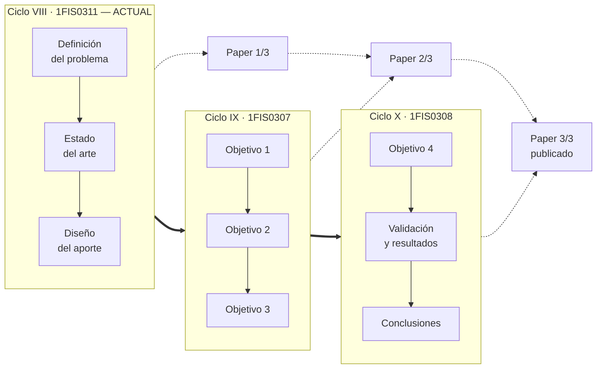
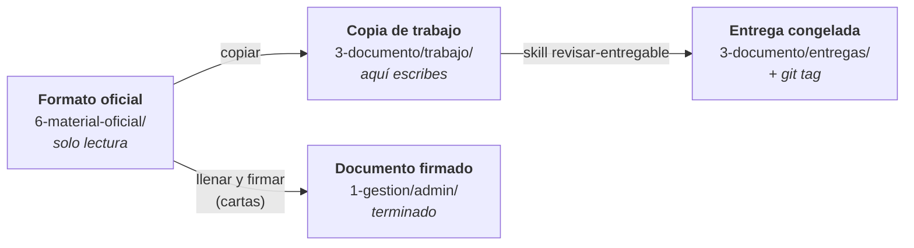

# Proyecto de Tesis — Ingeniería de Sistemas UPC

**Un solo proyecto continuo repartido en tres ciclos**, no tres trabajos distintos.
Cada curso continúa donde terminó el anterior, sobre el mismo documento y el mismo paper.



| Ciclo | Curso | Produce |
|---|---|---|
| VIII | **1FIS0311 Seminario de Investigación Aplicada** ← actual (2026-25) | Problema · Estado del arte · Diseño del aporte · Plan · Paper 1/3 |
| IX | 1FIS0307 Proyecto de Investigación 1 | Objetivos 1-3 de la solución · Paper 2/3 |
| X | 1FIS0308 Proyecto de Investigación 2 | Objetivo 4 · Validación · Resultados · Conclusiones · Paper 3/3 |

**Empieza por [`1-gestion/CONTEXTO.md`](1-gestion/CONTEXTO.md)** — hechos del curso, fechas, pesos,
criterios de fuentes y estado actual. Las reglas de trabajo están en [`CLAUDE.md`](CLAUDE.md).

---

## Estructura

```
tesis/
├── CLAUDE.md            Reglas de trabajo, marcadas por origen
├── gh-tesis             Envoltorio de gh aislado del entorno de trabajo
│
├── 1-gestion/           Cómo va el proyecto: plazos, dudas, actas, bitácora
├── 2-fuentes/           Lo que has leído: PDFs, fichas, referencias
├── 3-documento/         La tesis: lo que escribes y lo que entregas
├── 4-paper/             El artículo científico (IEEE)
├── 5-solucion/          El aporte construido: código, datos, resultados
├── 6-material-oficial/  Lo que da la universidad · SOLO LECTURA
└── 7-archivo/           Lo descartado, por si hay que volver
```

<details>
<summary><b>Detalle de cada carpeta</b> — qué guarda y cuándo la tocas</summary>

### `1-gestion/` — cómo va el proyecto

| | Qué guarda | Cuándo lo tocas |
|---|---|---|
| `CONTEXTO.md` | Hechos del curso: estructura de capítulos, pesos, criterios de fuentes, estado actual | **Al empezar cualquier sesión** |
| `cronograma.md` | Las 15 semanas, los hitos de evaluación y la carga de artículos | Al planificar la semana |
| `preguntas-abiertas.md` | Dudas para asesor / profesor / coordinación, con la pregunta literal lista para copiar | Antes de cada asesoría |
| `bitacora/` | Qué hiciste, qué decidiste y **por qué**. Una entrada por sesión | Al cerrar el día |
| `asesorias/` | Actas de reunión — artefacto de gestión **evaluado** | Después de cada asesoría |
| `plan-proyecto/` | Alcance, cronograma, calidad, riesgos | Semana 13 |
| `admin/` | Documentos administrativos ya firmados | Semana 3 (las dos cartas) |

### `2-fuentes/` — lo que has leído

Es el activo que más valor acumula: se usa en los tres ciclos y crece hasta los 24 artículos.

| | Qué guarda | Cuándo lo tocas |
|---|---|---|
| `busquedas/` | Cadena ejecutada, base, fecha y números del cribado, por búsqueda | Al buscar en Scopus o WoS |
| `pdfs/` | Los artículos originales. Se renombran, **nunca se editan**. No se versionan en git | Al descargar un artículo |
| `fichas/` | Una nota de lectura por artículo, con formato fijo para poder compararlos. **Uso interno** | Al fichar cada artículo |
| `biblioteca.bib` | Todas las referencias, exportadas desde Zotero | Cada vez que añades artículos |
| `matriz-estado-arte.csv` | Una fila por artículo → se convierte en la tabla comparativa del cap. 2.3 | Al fichar cada artículo |
| `guia-zotero.md` | Cómo importar de Scopus, verificar cuartil y citar en APA-7 e IEEE | Al montar Zotero |

### `3-documento/` — la tesis

Todo lo de aquí lo escribes tú. No hay nada de solo lectura.

| | Qué guarda | Cuándo lo tocas |
|---|---|---|
| `trabajo/` | Los `.docx` en los que escribes, copiados del formato oficial | A diario |
| `entregas/` | Copia congelada de cada entrega evaluada, con su `git tag` | Al entregar TB1, TB2, TB3 |

### `4-paper/` — el artículo científico

Se redacta en **IEEE**, no en APA-7. Empieza en la semana 10 (título e introducción)
y se refina hasta la 13. Avanza en los tres ciclos: Paper 1/3 → 2/3 → 3/3 publicado.

| | Qué guarda |
|---|---|
| `borradores/` | Versiones del artículo en curso |
| `figuras/` | Gráficos y diagramas del paper |

### `5-solucion/` — el aporte construido

Vacía durante el ciclo VIII. Se llena en Proyecto de Investigación 1 y 2.

| | Qué guarda |
|---|---|
| `data/raw/` | Datos originales, **inmutables**. No se versionan en git |
| `data/processed/` | Datos limpios y derivados |
| `src/` | Código de la solución |
| `results/` | Figuras, tablas y resultados generados |

### `6-material-oficial/` — lo que da la universidad

**Nada aquí se edita, renombra ni reorganiza.** Es la evidencia de lo que se pidió.

| | Qué guarda |
|---|---|
| `general/` | Transversal a los 3 ciclos: las dos cartas a firmar |
| `2026-25-seminario-investigacion/clase-01/` | Láminas y lecturas de la clase 1 |
| `2026-25-seminario-investigacion/formatos/` | Formularios a llenar (Plan de Trabajo, semana 2) |
| `2026-25-seminario-investigacion/*.pdf` | Línea de tiempo oficial del ciclo |
| `proyecto-investigacion-1/` · `-2/` | Vacías: se llenan en los ciclos IX y X |

</details>

### La regla que ordena todo

**Si lo dio la universidad, está en `6-material-oficial/` y no se toca.
Todo lo demás lo produces tú.**

De ahí se derivan las otras dos: los formatos de entregable los da el profesor semana a semana
(si falta uno, se pide — no se inventa), y para trabajar **se copia** el original,
nunca se edita en su sitio.



La ubicación de un archivo dice **quién es su dueño y en qué estado está**.
La numeración `1-` a `7-` dice **cuándo lo trabajas**.

---

## Flujo semanal

1. Abrir `1-gestion/CONTEXTO.md` §11 y `cronograma.md` → qué semana es y qué toca
2. Buscar fuentes con la skill `buscar-fuentes` → registro en `2-fuentes/busquedas/`
3. Fichar cada artículo aceptado (`fichar-articulo`) → ficha + BibTeX + fila de matriz
4. **Copiar** el formato de `6-material-oficial/<ciclo>/formatos/` a `3-documento/trabajo/`
   y redactar ahí en Word, citando desde Zotero. El original nunca se edita.
5. Cerrar con la skill `bitacora` y un commit

**Antes de cada entrega:** skill `revisar-entregable`. Congela la copia en `3-documento/entregas/`
y etiqueta en git (`git tag TB1-2026-25`).

## Skills disponibles

| Skill | Para qué |
|---|---|
| `buscar-fuentes` | Cadenas para Scopus/WoS, criterios de cribado, registro de la búsqueda |
| `fichar-articulo` | PDF → ficha + BibTeX + fila de la matriz |
| `estado-del-arte` | Construir el capítulo 2 y encontrar la brecha |
| `revisar-entregable` | Auditoría antes de TB1/TB2/TB3/DD |
| `bitacora` | Registro de sesión y actas de asesoría |

## Herramientas

- **Gestor bibliográfico:** Zotero → `2-fuentes/guia-zotero.md`
- **Bases:** Scopus, Web of Science, SCImago (cuartiles)
- **Texto de PDF:** `pdftotext -layout archivo.pdf -`

### Git

Repo privado en `github.com/upcgithub/tesis-upc`, **aislado del entorno de trabajo**:
la identidad de git es local a este repo y la credencial de GitHub vive en `.gh/`
(ignorada por git). No toca `~/.gitconfig` ni la cuenta de `github.disney.com`.

- `git add` / `commit` / `push` / `pull` funcionan normal
- Para comandos de GitHub usar **`./gh-tesis`** en lugar de `gh`

---

## Estado del ciclo 2026-25

| | |
|---|---|
| Carga | **24 artículos** Q1/Q2 entre las semanas 6 y 10 (~5 por semana) |
| Evaluaciones | TB1 sem. 7 (20 %) · TB2 sem. 11 (20 %) · TB3 sem. 15 (30 %) · DD sem. 15 (30 %) |
| Plazo más cercano | **Semana 3:** entregar firmadas las dos cartas de `6-material-oficial/general/` |
| Preguntas abiertas | **7** pendientes de asesoría → `1-gestion/preguntas-abiertas.md` |

**Por definir:** tema, compañero de equipo y asesor → actualizar `CONTEXTO.md` §11.
